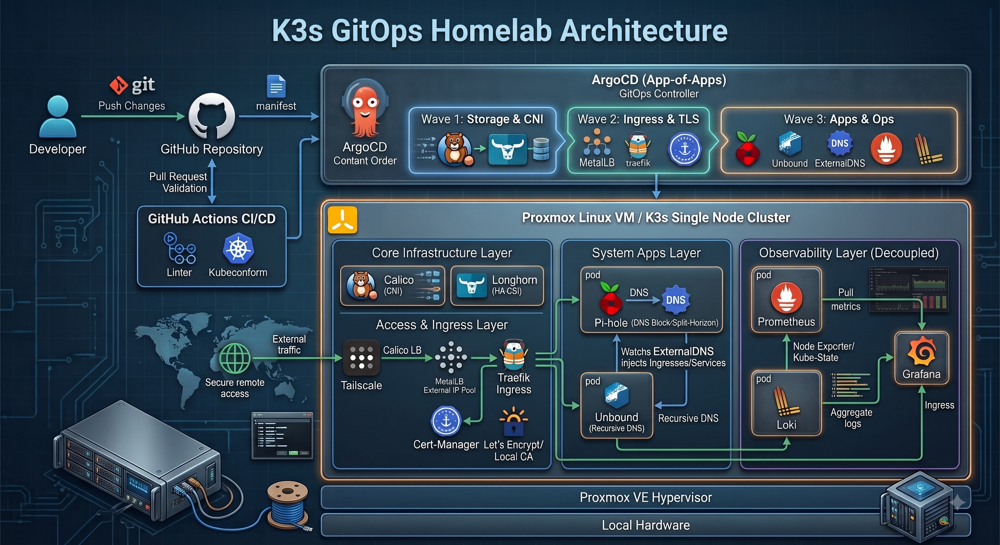

# 🚀 Enterprise GitOps Homelab


A GitOps-driven local Kubernetes homelab. This repository is the source of truth for the infrastructure, using **Terraform**, **K3s**, and the **Argo CD App-of-Apps** pattern to manage cluster services from Git.

## 🏗️ Architecture & Tech Stack



* **Infrastructure:** Proxmox VM provisioned with Terraform.
* **Cluster Engine:** K3s lightweight Kubernetes.
* **GitOps Controller:** Argo CD App-of-Apps with sync waves.
* **Networking & Ingress:** Calico CNI, MetalLB LoadBalancer IPAM, Traefik ingress.
* **TLS:** cert-manager with local self-signed issuer by default. Public Let’s Encrypt requires a real DNS domain and reachable HTTP-01 or DNS-01 validation.
* **DNS & Routing:** Pi-hole for LAN DNS/ad-blocking and Unbound for recursive upstream DNS.
* **Storage:** Longhorn CSI. Current setup is single-node with one replica; HA requires additional nodes/disks.
* **Observability:** Prometheus metrics, Loki logs, Grafana dashboards, and Alloy log collection.
* **Remote Access:** Tailscale for CI or remote homelab access.

See [docs/Service-Catalog.md](docs/Service-Catalog.md) for service URLs, namespaces, and exposure methods.

See [docs/Proxmox-Environment.md](docs/Proxmox-Environment.md) for the current Proxmox node and K3s VM inventory, including the captured environment overview.

## ⚙️ GitOps Workflow

1. **Develop:** Changes are made on `dev`.
2. **Validate:** GitHub Actions checks Kubernetes manifests, Helm rendering, Kubeconform, Trivy, Terraform format/validate, and TFLint where applicable.
3. **Promote:** A pull request merges `dev` into `main` after checks pass.
4. **Reconcile:** Argo CD watches `main`, renders the application registry, and reconciles the K3s cluster to match the repository.

The Argo CD Application registry is documented in [docs/Argo-Application-Registry.md](docs/Argo-Application-Registry.md).

## 🚀 Bootstrap Process

Use this flow for a new node or disaster recovery rebuild.

1. Provision the VM:

   ```bash
   cd terraform
   terraform apply
   ```

2. Install K3s and the bootstrap CNI:

   ```bash
   ./kubernetes/bootstrap/install-k3s.sh
   ```

3. Install Argo CD and apply the root application:

   ```bash
   ./kubernetes/bootstrap/install-argocd.sh
   ```

4. Verify Argo CD and cluster services:

   ```bash
   kubectl get app -n argocd
   kubectl get pods -A
   kubectl get svc -A | grep LoadBalancer
   ```

## 🌐 Local Routing Model

Traefik is the main HTTP/HTTPS entrypoint at `192.168.86.200`. Pi-hole provides LAN DNS on `192.168.86.201` and resolves `*.homelab.local` hostnames back to Traefik.

Expected core routes:

| Service | Hostname |
| --- | --- |
| Grafana | `grafana.homelab.local` |
| Pi-hole Web UI | `pihole.homelab.local` |
| Longhorn UI | `longhorn.homelab.local` |
| Prometheus | `prometheus.homelab.local` |
| Monikey | `monikey.homelab.local` |

## 🔐 Secrets Status

Some admin passwords are still placeholders in Helm values. The next recommended milestone is to move application credentials into a proper secrets workflow such as SOPS, Sealed Secrets, or External Secrets Operator.
