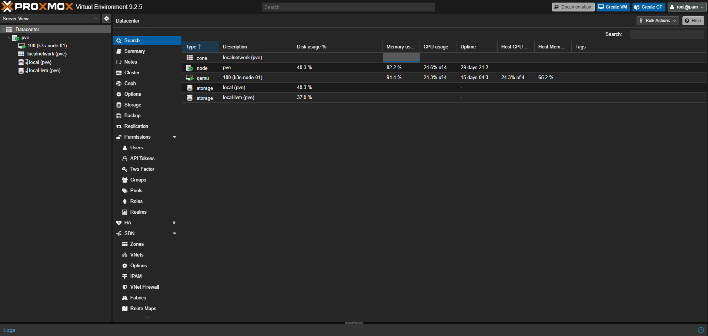

# Proxmox Environment

The homelab runs on Proxmox VE. The current environment shown in the captured Proxmox overview is:

| Component | Observed value |
| --- | --- |
| Proxmox node | `pve` |
| Proxmox version | 9.2.5 |
| K3s VM | VM ID `100`, `k3s-node-01` |
| VM CPU | 4 vCPU allocated; approximately 24% usage at capture time |
| VM memory | Approximately 65.2% host memory usage at capture time |
| Node CPU | Approximately 24.6% of 4 CPUs at capture time |
| Node memory | Approximately 82.2% usage at capture time |
| Storage | `local (pve)` and `local-lvm (pve)` |
| Network | `localnetwork (pve)` |

## Infrastructure relevance

This confirms the current repository topology: one K3s VM on one Proxmox node. It supports the existing homelab platform and an initial three-tier application, but it is not highly available.

The current single-node design means:

- A Proxmox node or VM failure affects the whole Kubernetes cluster.
- Longhorn cannot provide node-level redundancy with only one node.
- PostgreSQL persistence still requires independent backups.
- Additional Proxmox VMs and Kubernetes nodes are required before using replicated workloads and storage for high availability.

## Resource-right-sizing baseline

The workloads are sized for this single 4-vCPU/8-GiB node. Helm-managed services
have explicit requests and limits in `kubernetes/helm/`; low-traffic platform
components use small reservations, while Prometheus, Loki, and Grafana retain
larger memory ceilings for query and ingestion bursts. Prometheus is capped at
7 GB of TSDB data and Loki at 7 days of logs.

Existing PVC sizes were intentionally not reduced: Kubernetes and Longhorn do
not generally support shrinking an already-bound claim. Reclaiming space should
be done with a planned backup, migration, and claim recreation.

See [Architecture](Architecture.png), [Service Catalog](Service-Catalog.md), and [Troubleshooting](Troubleshooting.md) for the broader platform documentation.
